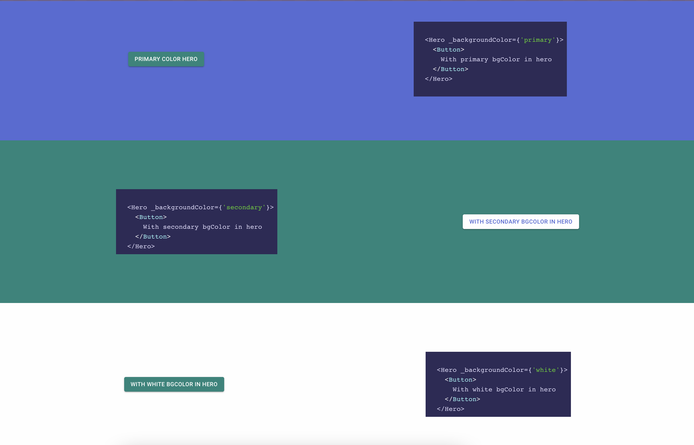

# smart-contrast-color

using react context to automatize color button based on your Hero color

### tags
- react
- context-api
- mui

## How its works

we have a context `contrastContext` that we put in the hero component's tree, assigning the `color` value of the context with the hero's color

in the button component we call the `useContrastColor` hook to get the hero's contrast color

if the hero has a dark color then the button is white, otherwise the button has the main theme color

